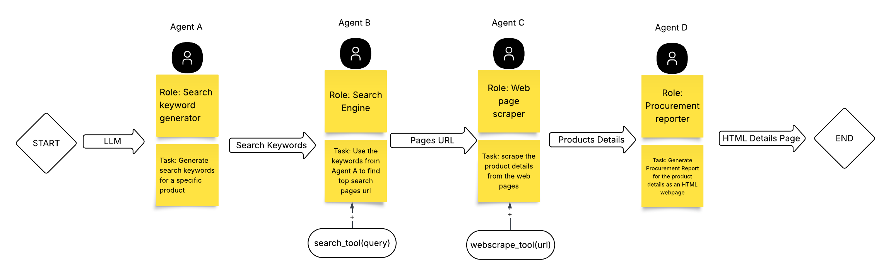
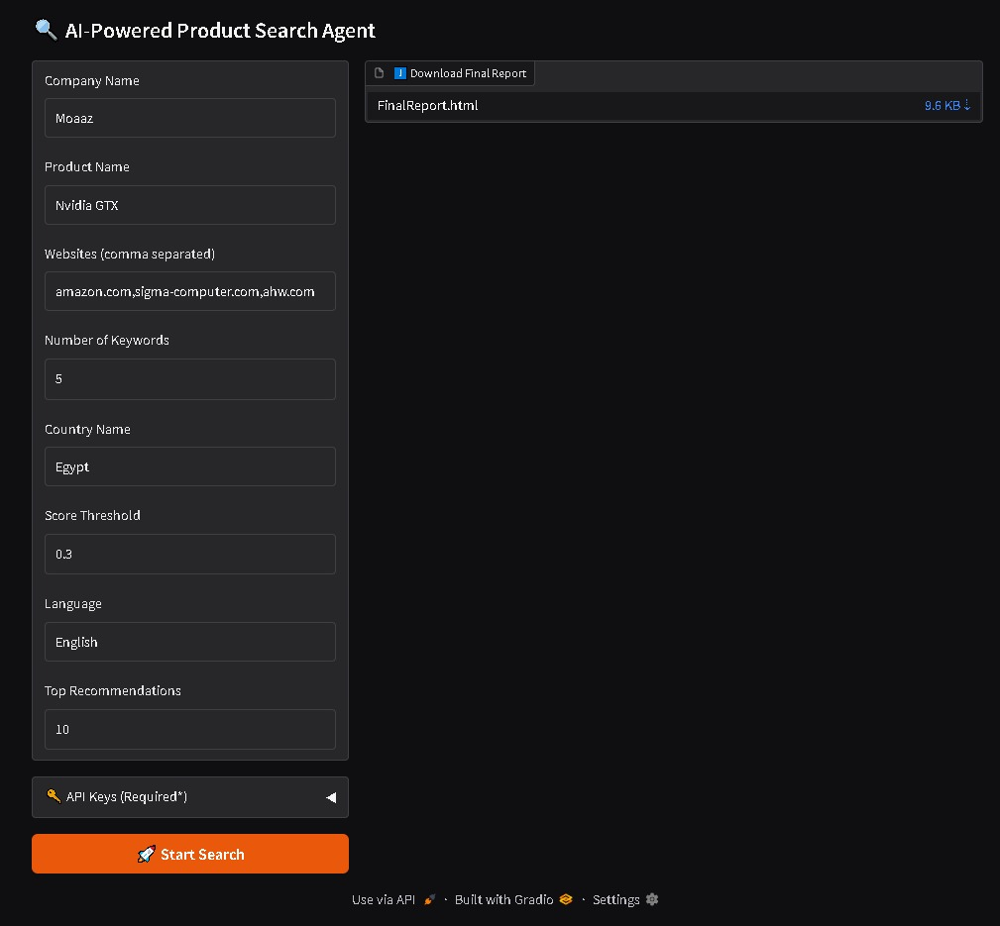

# Overview

A multi-agent system built using CrewAI

It automates product procurement reporting by chaining multiple AI agents that:

1. Generate search keywords for a given product.

2. Search the web for relevant product pages.

3. Scrape details from those pages.

4. Generate an HTML procurement report.

-------
# User Interface

-------
# Inputs
1. **Company Name:** The name of that company to include in the final report.
2. **Product Name:** The name of the product you want to search.
3. **Websites:** Websites to search on it, if empty it will search the whole internet(not Recommended)/
4. **Number of Keywords:** Number of keywords that will be used to search the product.
5. **Country Name:** The country In which this product is available.
6. **Search Score:** Searching score to filter the irrlevant pages.
7. **Language:** The language In which you will search.
8. **Top Recommendtion:** Best Pages Result With best prices.

--------
# Example Result
- After Running The Program, it will take a few minutes to process.
- You will find your final report in `src/data/finalReport.html`
- [View report online](https://github.com/Animo-GD/AI-Powered-Search-Multi-Agents/blob/cb3ab65dd7197132c59eef57edc7960aec0e4b9b/FinalReport.html)

